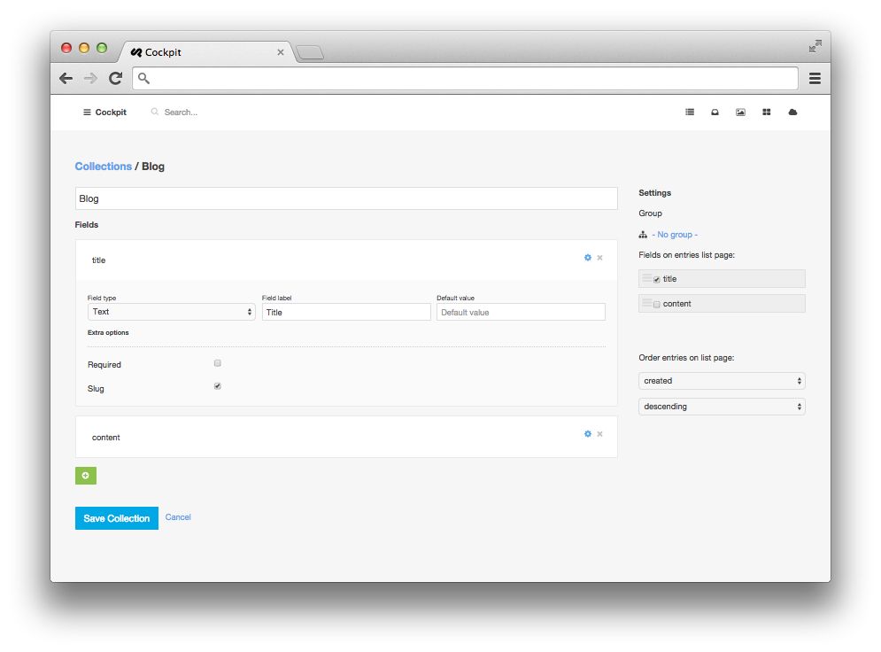

### Collections


<span class="uk-badge">Collections</span> is a powerful feature that comes with Cockpit.
With collections you can manage different types of content lists.


Define a set of fields and start collecting items. Reuse them later on your website or even in a region.


<div class="uk-alert">
    If you're familiar with WordPress, you can compare collections to post types
    or as a simple Content Construction Kit (CCK) you have maybe experienced in systems like Drupal.
</div>





#### To get the items of any collection you can use the following commands:


    <?php $items = cockpit("collections")->collection(collectionname)->find()->toArray(); ?>

Shortcut version:

    <?php $items = collection(collectionname)->find()->toArray(); ?>

  You can also filter items:

      <?php $items = collection("posts")->find(["public"=>true])->sort(["created"=>1])->toArray(); ?>

  Filter via callback

      <?php
        $items = collection("posts")->find(function($post){
          return ($post["public"] === true && preg_match('/anyquery/i', $post["title"]));
        })->toArray();
      ?>

  Pagination

      <?php $items = collection("posts")->find()->limit(10)->skip(10)->toArray(); ?>

  Loop through collection:

      <?php foreach(collection("posts")->find() as $item): ?>
         <div>
             <?php echo $item["title"];?>
         </div>
      <?php endforeach;?>

  Just one item

      <?php $item = collection("posts")->findOne(["title"=>"Hello world!"]); ?>


---

## Module API


##### collection( $name )

Get entries collection.

```
$collection = cockpit('collections:collection', 'collectionname');

// get all entries
$collection->find([/* conditions */])->toArray();

// get one entry
$collection->findOne([/* conditions */]);
```

---

##### collections( $options = [] )

Get multiple collections.

```
$collections = cockpit('collections:collections', [
    'filter' => ['name'=>['$in'=>['blog','portfolio']]]
]);

$posts   = $collections['blog']->find()->toArray();
$entries = $collections['portfolio']->find()->toArray();

```

---

##### get_collection_by_slug( $slug )

Get entries collection by collections slug.

```
$collection = cockpit('collections:get_collection_by_slug', 'collection-slug-name');
```

---

##### group( $group, $sort = null )

Get all collections in a group.

```
$collections = cockpit('collections:group', 'groupname');
```

---

##### populate( $collection, $resultset )

---

##### populateOne( $collection, $item )

